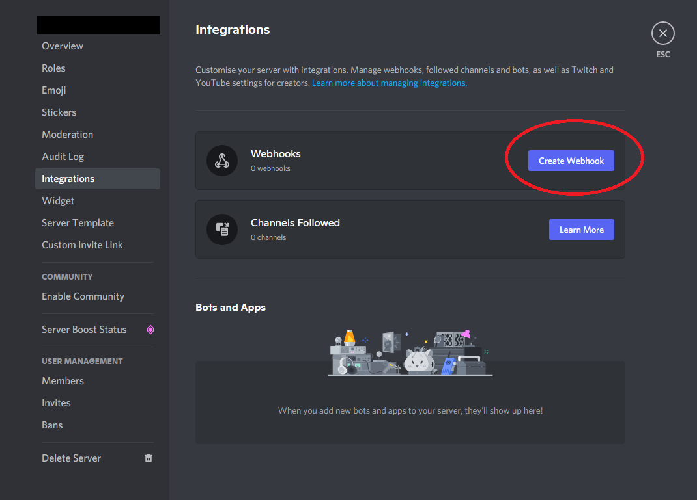
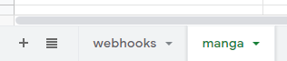
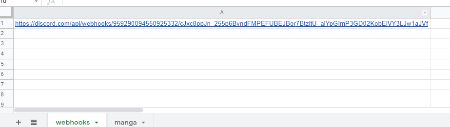
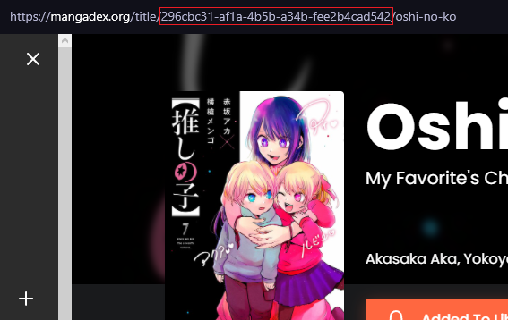
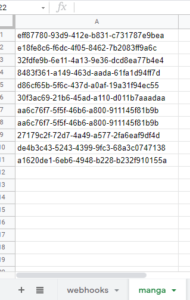
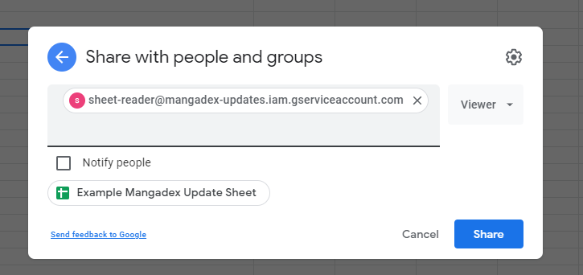

# Discord webhook for Mangadex chapter updates
A script that uses Mangadex's v5 API to automatically forward chapter updates to Discord webhooks.

Very simple to setup, no downloads required, simply create a Google Sheet and share it with the bot.

# Setup
## Prerequisites
- Discord server where you (or someone who can help you) have the `Manage Webhooks` permission 
- Google account

## Steps
### Creating the Discord webhook
First we need to create a Discord webhook to allow the script to send updates to a channel.
- Open your Discord server's `Server Settings` and navigate to `Integrations` and click `Create Webhook`.
- (If you already had existing webhooks, click `View Webhooks` and then `New Webhook`).

- Name your webhook whatever you like, but ensure it is sending to the channel you want it to.

### Creating the Google Sheet
Now we need to create a Google Sheet that tells the script where to send updates to, and which manga to send updates for. Click [here](https://docs.google.com/spreadsheets/d/1jDIZMK1dT6ZuP63rPBmCinSlofFEsf6NraHhcmjKmRI/edit?usp=sharing) for an example of what your finished sheet should look like.

- If you open the example, you can go to `File > Make a new copy` and use that spreadsheet as a template.
- If you so choose, you can [create your own](https://sheets.new/), but make sure that your spreadsheet has two worksheets named `webhooks` and `manga` as below. Order matters.

- First we need to give our webhooks. Get your webhook's URL by clicking `Copy URL`.

- Paste this into the first column of the `webhooks` worksheet.

- Next we need to create the list of manga. For each manga you want to track, go to MangaDex and find find its ID from the URL.

- Paste each of these IDs into the first column of the `manga` worksheet.

- Only the first column is important, you may write whatever you like in the other columns. This might be helpful for keeping track of the manga each ID corresponds to.
- You may add as many webhooks as you like for any number of servers and channels, and any number of manga IDs. Note that if you want different channels to track different manga, you will need to create separate Google Sheets.

### Sharing the Google Sheet
The final step is to give the script access to your Google Sheet.

- In your Google Sheet, click `Share` and share your sheet to `sheet-reader@mangadex-updates.iam.gserviceaccount.com` as a `Viewer`.

### Done!
The script will now send any updates for manga in your `manga` sheet to any webhooks in your `webhooks` sheet! Note this process is run every hour, and there will be nothing sent if no updates are found. If you are having any trouble, or would like to request a featutre, you can contact me on Discord at `@marsh#0943`.

# Planned Features
- Support for MDLists
- Support for languages other than English
- Support for custom embed messages
- Support for MangaDex account follow lists
