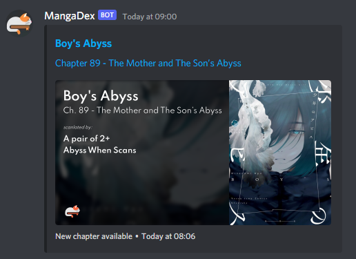
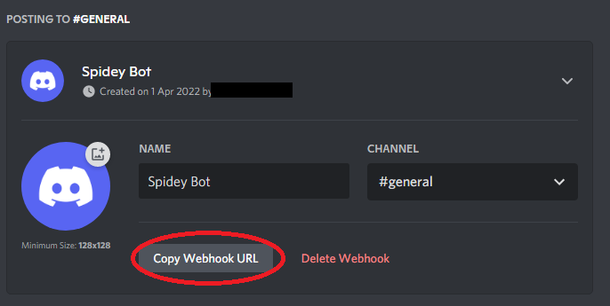

# Mangadex Updates Webhook
A bot that uses Mangadex's v5 API to automatically forward chapter updates to Discord webhooks.

Very simple to set up, no downloads required, simply create a Google Sheet and share it with the bot.

## New Feature: Language Support
You can now fetch chapters for **languages other than English**! All you need to do is add the language codes you want updates for in column next to the Manga ID (example below).

Notes:
- Description of valid language codes found [here](https://api.mangadex.org/docs/3-enumerations/#language-codes--localization)
- Multiple languages for one manga can be specified by entering a comma-separated list
- If no language is specified, only English chapters will be fetched
- For those currently using the second column for other purposes, the script ignores anything that is not a language, so you don't need to change anything

# Setup
## Prerequisites
- Discord server where you (or someone who can help you) have the `Manage Webhooks` permission 
- Google account

## Steps
### Creating the Google Sheet
First we need to create a Google Sheet that tells the bot where to send updates to, and which manga to send updates for. Click [here](https://docs.google.com/spreadsheets/d/1jDIZMK1dT6ZuP63rPBmCinSlofFEsf6NraHhcmjKmRI/edit?usp=sharing) for an example of what your finished sheet should look like.

- If you open the example linked above, you can go to `File > Make a new copy` and use that spreadsheet as a template.
- If you so choose, you can [create your own](https://sheets.new/), but make sure that your spreadsheet has two worksheets named `webhooks` and `manga` as below. These names are **CASE SENSITIVE**.

### Creating the Discord webhook
Next we want to create a webhook for the program to send updates to.
- Open your Discord server's `Server Settings` and navigate to `Integrations` and click `Create Webhook`.
- (If you already had existing webhooks, click `View Webhooks` and then `New Webhook`).

- Name your webhook whatever you like, but ensure it is sending to the channel you want it to.
- Now we will tell the program to send updates to this webhook. Get your webhook's URL by clicking `Copy URL`.

- Paste this URL into the first column of the `webhooks` worksheet.

### Adding manga
Next we need to create a list of manga to track updates for.
- For each manga you want to track, go to MangaDex and find its ID from the URL.

- Paste each of these IDs into the first column of the `manga` worksheet.

- If you want updates from languages other than English, you can specify them in a comma separated-list next to each manga ID
- Description of valid language codes found [here](https://api.mangadex.org/docs/3-enumerations/#language-codes--localization)

- Only the first two columns are important, you may write whatever you like in the other columns. This might be helpful for keeping track of the manga each ID corresponds to.
- You can add any number of manga, and you can come back and add new ones whenever!
- Note that if you want different channels to track different manga, you will need to create separate Google Sheets to separate the webhooks.

### Sharing the Google Sheet
The final step is to give the script access to your Google Sheet.

- In your Google Sheet, click `Share` and share your sheet to `sheet-reader@mangadex-updates.iam.gserviceaccount.com` as a `Viewer`.

### Done!
The script will now send any updates for manga in your `manga` sheet to any webhooks in your `webhooks` sheet! Note this process is run every hour, and there will be nothing sent if no updates are found.
If you are having any trouble, or would like to request a feature, you can contact me on Discord at `@marshdapro`.

# Planned Features
- Support for MDLists
- Support for custom embed messages
- Support for MangaDex account follow lists
